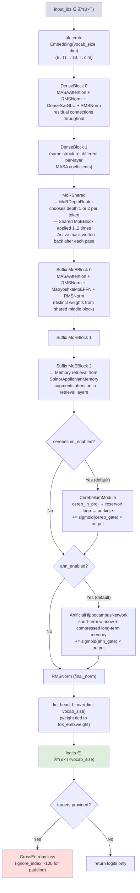
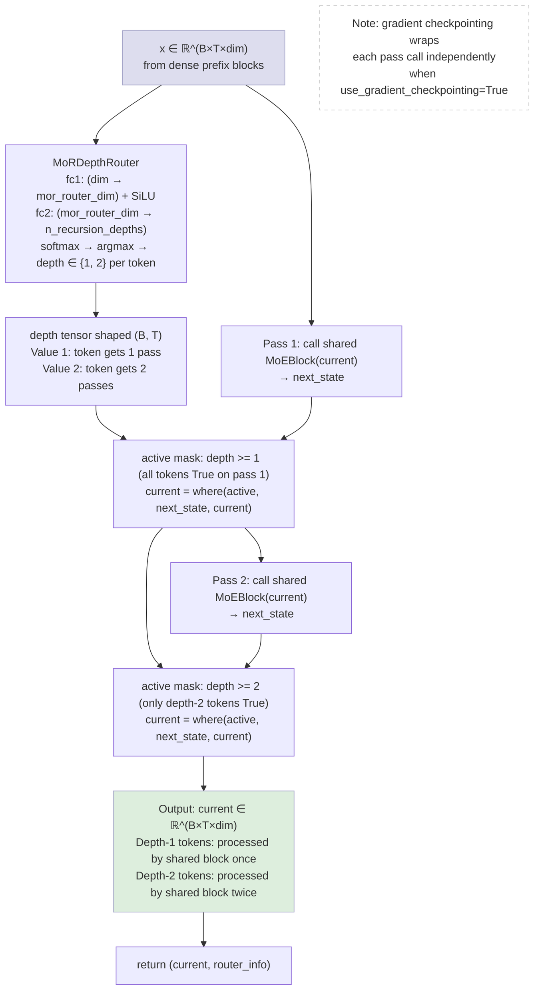
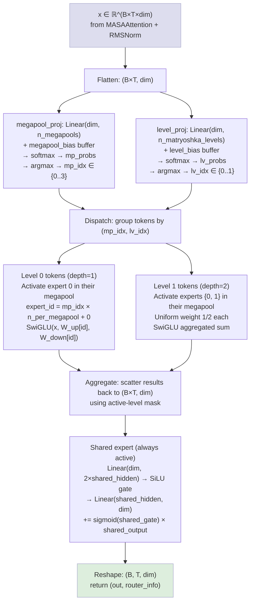
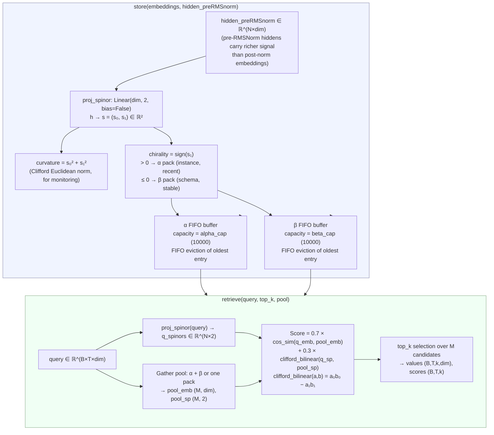
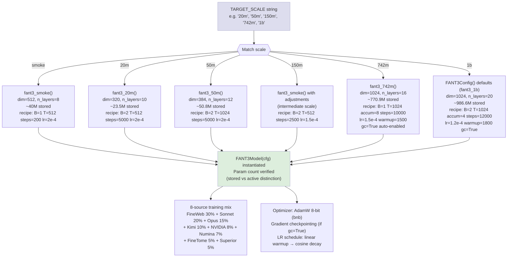
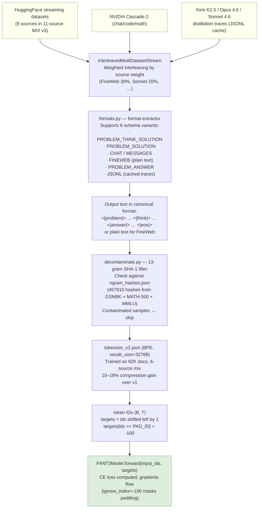

# FANT 3 Architecture Diagrams

All diagrams use Mermaid syntax and render in GitHub. Open any `.md` file in GitHub to see them as visual flow charts.

---

## Diagram 1: Full Forward Pass

This diagram shows a single forward call through `FANT3Model.forward()` for the `fant3_742m` preset (16 layers: 2 dense prefix, 11 shared middle via MoR, 3 suffix MoE).

---

## Diagram 2: MoR (Mixture of Recursions) Recursion Flow

This diagram zooms into `MoRShared.forward()` showing how per-token depth routing works. The shared `MoEBlock` is called `max_depth` (2) times; only tokens that need more compute receive subsequent passes.

---

## Diagram 3: Matryoshka MoE (Mixture of Experts) Routing

This diagram shows `MatryoshkaMoEFFN.forward()`. Each token independently selects a megapool and a nesting level that determines how many experts in that pool are activated.

---

## Diagram 4: SpinorApollonianMemory Store and Retrieve

This diagram shows the full lifecycle of the spinor-based long-term memory: how embeddings are classified and stored (during Phase 4+ training), and how queries retrieve from both packs.

---

## Diagram 5: Scale-Aware Config and Training Recipe Selection

This diagram shows how the Colab notebook maps a `TARGET_SCALE` string to a model config and a matching training recipe.

---

## Diagram 6: Data Pipeline

This diagram shows how raw data flows from HuggingFace dataset streams through format extraction, decontamination, tokenization, and into the model forward pass.

